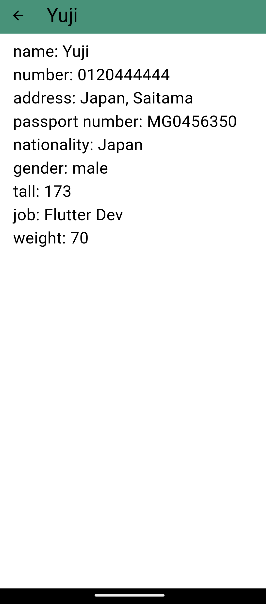

   
  
   
   
  

 

 

## • Overview

This is an information management app. Customer can access and modify their information easily. Company can get customer's information easily too. But they can access only ones who allow to read their information.

The idea arised from my experience. In Japan, we have to write a lot of paper of our information, name, address, number, etc. We have to write the same information many times. We're annoyed this system. So I come up with the idea that we manage their information and make it more easy to access their information.

### 👨‍👩‍👦‍👦Customer Pages

LogIn Screen               |  SignUp Screen     
:-------------------------:|:-------------------------:
|

Company List Screen |  Input Screen
:-------------------------:|:-------------------------:
|

### 🕋For Company

SignIn Screen |  SignUp Screen
:-------------------------:|:-------------------------:
|

Customer List Screen |  Customer Information Screen
:-------------------------:|:-------------------------:
|

## • Launch

1. run `flutter pub get` in terminal.

2. prepare android emulator.

3. run `flutter run` in terminal.